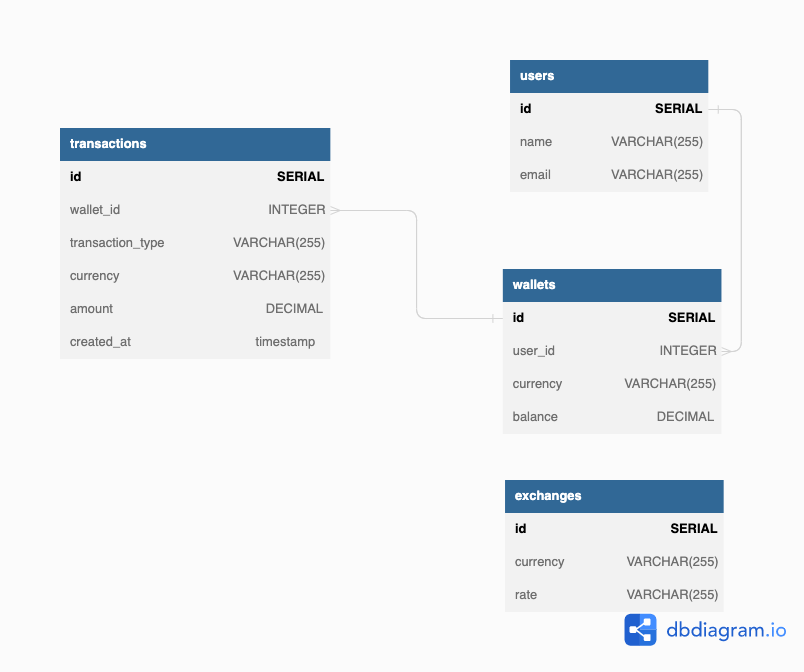

# wallet-service
A mini wallet service project with Clean Architecture


Flow of HTTP request in clean architecture at this service.

```
    HTTP > usecase
           usecase > repository (Postgres)
           usecase < repository (Postgres)
    HTTP < usecase
```

Controller and Database are in the outer layer. They know nothing about each other. These two layers use `usecase` (business logic) to comminicate. The business rules are not bound to the database.

#### Wallet Service DB Diagram




## Content

- [Usage](#usage)
- [Endpoints](#enpoints)
- [Project structure](#project-structure)


## Usage
For local usage, run your terminal:

```sh
 docker compose up
```

Then ready to GO.

## Endpoints

### `POST   http://localhost:8080/v1/user`
This endpoint crate an user. 

Request model;

```json
{
      "name": "John Dee",
      "email": "john.dee@gmail.com"       
}
```

### `POST   http://localhost:8080/v1/wallet`

This endpoint crate a wallet. 

Request model;

```json
{
     "user_id": 7,
     "currency": "USD"
}
```

### `GET    http://localhost:8080/v1/user/:id/wallet`

This endpoint get wallet by user id. 

### `POST   http://localhost:8080/v1/transaction`

This endpoint crate a deposit/withdraw transaction. 

Request model;

```json
{
     "wallet_id": 1,
     "transactionType": "deposit",
     "currency": "USD",
     "amount": 100.25
}

```

### `GET    http://localhost:8080/v1/transaction/history`

This endpoint get all transaction history. 

## Project structure

### `cmd/wallet/main.go`

Configuration and logger initialization. Then the main function "continues" in `internal/app/app.go` with `app.Run(cfg)` function.

### `config`

The config folder has config structure and `config.yml`. For configuration, I used [viper](https://github.com/spf13/viper) library. This is most popular configuration library for config management.

### `internal/app`
_Run_ function in the `app.go` file, which "continues" the _main_ function. This is where all the main objects are created.

### `internal/controller`
The Controller layer has handler, router. The structure of the business logic is injected into the router structure, which will be called by the handlers.

### `internal/entity`
Interfaces and Entities of business logic (models) can be used in any layer.

### `internal/entity/mocks` 
The Mocks are generated to interface. I used [mockery](https://github.com/vektra/mockery).

### `internal/core/repository`
A repository is an abstract storage (database) that business logic works with.

### `internal/core/usecase`
Business logic and usecase tests.
### `pkg`
     The pkg folder has external package. Which is database(postgres), logger (zerolog), httpserver(gin) .

### `pkg/db`
The pkg folder has database.go for db configuration and migration folder. I manage to migration with [goose](https://github.com/pressly/goose) tool.